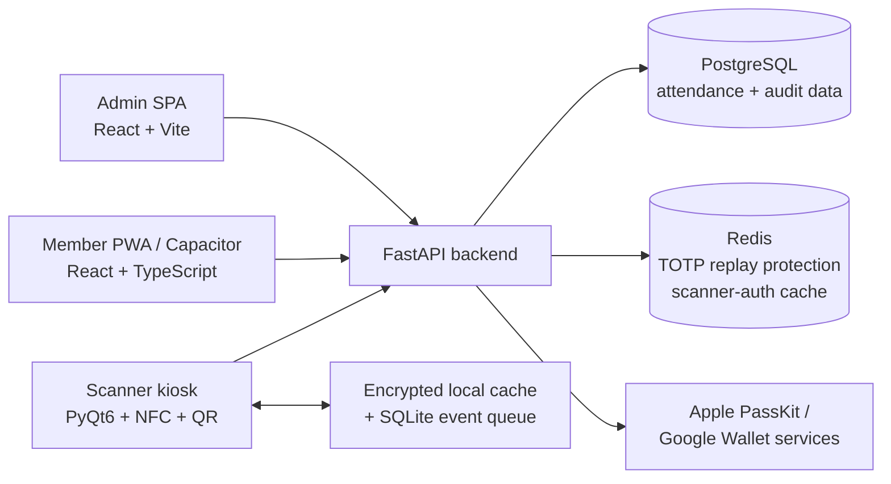

# Meridian

Meridian is a full-stack attendance system for FRC robotics teams. It combines a FastAPI backend, React admin dashboard, member PWA, and a PyQt6 scanner kiosk for NFC/QR check-in and checkout, hour tracking, geofence workflows, approvals, reporting, and offline scanner recovery.

## Screenshots

| Admin dashboard | Geofence editor |
| --- | --- |
|  |  |


## Architecture



| Component | Stack |
| --- | --- |
| Backend | Python 3.12, FastAPI, SQLAlchemy 2 async, Alembic, PostgreSQL |
| Admin dashboard | React 18, Vite, TypeScript, Tailwind CSS |
| Member app | React 18, Vite, TypeScript, Tailwind CSS, Capacitor |
| Scanner kiosk | Python, PyQt6, pyscard, OpenCV/pyzbar, PyInstaller |
| Ephemeral state | Redis for QR replay protection and scanner-auth caching |

## Implemented features

- **NFC and QR attendance** — HMAC-validated NFC payloads plus TOTP QR validation with replay protection. The member PWA renders the live rotating TOTP QR.
- **Scanner kiosk** — fullscreen PyQt6 interface with NFC/QR readers, webcam preview, scanner heartbeat, local status, and a simulator for development.
- **Offline scanner recovery** — AES-GCM encrypted member cache, SQLite-backed event queue, cached open-session state, and ordered queue replay after reconnect.
- **Attendance integrity** — the database now enforces at most one open session per member with a unique partial index.
- **Geofence workflows** — configurable zones, exit/return handling, grace-period checkout flows, and admin visibility.
- **Hours and approvals** — daily/weekly/season totals, cap-warning records, self-reported checkout, flagged-session approval/denial, and auto-timeout handling.
- **Reporting and operations** — CSV/PDF export, season management, member import, dashboard statistics, and an audit log.
- **Wallet services** — backend generation paths for Apple PassKit bundles and Google Wallet objects/save links.
- **PII protection** — names, emails, and phones are stored through PostgreSQL pgcrypto helpers.

### Current scope notes

The repository keeps claims aligned with what is wired end-to-end today. FCM/APNs helper code exists, but push delivery is not currently invoked by the core checkout/hour-cap flow. SlowAPI request limits use their default process-local storage rather than Redis-backed rate limiting. Wallet barcode payloads currently contain a placeholder code; the rotating QR experience is implemented in the PWA, not inside the Wallet pass.

## Project structure

```text
Meridian/
├── backend/                  # FastAPI API, models, services, Alembic migrations
│   ├── app/
│   ├── scripts/
│   └── tests/
├── admin/                    # React admin dashboard
├── pwa/                      # Member PWA + Capacitor shells
├── scanner/                  # PyQt6 kiosk and offline queue/cache
├── shared/                   # Shared React auth/toast code and design tokens
├── docs/screenshots/         # Portfolio/readme screenshots
└── .github/workflows/        # CI
```

## Scanner offline flow

1. While online, the scanner downloads an encrypted snapshot of active members and whether each member currently has an open session.
2. On startup, the kiosk loads that cache and restores its cache version/open-session state.
3. If a transport failure occurs during a scan, the kiosk uses cached session state to decide whether the event is a check-in or checkout.
4. Offline events are written to SQLite and replayed in order through `/scanner/flush-queue` after connectivity returns.
5. Unknown members are rejected offline rather than being queued without a cached membership record.

## Selected API routes

| Route | Auth | Purpose |
| --- | --- | --- |
| `POST /auth/login` | Public | Member/admin login |
| `POST /scanner/checkin` | Scanner | NFC/QR check-in |
| `POST /scanner/checkout` | Scanner | NFC/QR checkout |
| `GET /scanner/cache` | Scanner | Offline member/open-session snapshot |
| `POST /scanner/heartbeat` | Scanner | Connectivity + cache-version check |
| `POST /scanner/flush-queue` | Scanner | Replay offline events |
| `GET /admin/dashboard` | Admin/Mentor | Attendance overview |
| `GET /sessions` | Admin | Filterable session list |
| `PATCH /sessions/{id}/approve` | Admin | Approve a flagged session |
| `PATCH /sessions/{id}/deny` | Admin | Deny a flagged session |
| `GET /admin/export` | Admin/Mentor | CSV/PDF export |
| `GET /geofence/config` | Member | Scanner/site geofence configuration |

## Getting started

### Backend

```bash
cd backend
cp .env.example .env
# Fill in required secrets and connection strings.
pip install -e ".[dev]"
alembic upgrade head
uvicorn app.main:app --reload
```

### Admin dashboard

```bash
cd admin
npm install
echo "VITE_API_URL=http://localhost:8000" > .env
npm run dev
```

### Member PWA

```bash
cd pwa
npm install
echo "VITE_API_URL=http://localhost:8000" > .env
npm run dev
```

### Scanner

```bash
cd scanner
pip install -r requirements.txt
# Set api_key in config.json locally; no scanner key is committed.
python -m src.app
```

For development seed data, `backend/scripts/seed_dev.py` generates a random scanner API key unless `DEV_SCANNER_API_KEY` is supplied in the environment. Copy the generated value into your local scanner configuration.

## Tests and CI

Backend unit tests cover scan validation and checkout state transitions:

```bash
cd backend
pytest -q
```

GitHub Actions runs the backend pytest suite for pull requests and pushes to `main`.

## Security notes

- Sensitive scanner cache files, salts, queue databases, and environment files are gitignored.
- Scanner API keys are bcrypt-hashed in the database; the committed scanner config contains no key.
- TOTP replay prevention uses Redis with a short TTL.
- NFC payloads are HMAC-SHA256 validated.
- JWT access/refresh tokens and role checks protect member/admin routes.
- A unique PostgreSQL partial index prevents concurrent creation of multiple open sessions for one member.
- Offline cache data is encrypted with AES-GCM using a PBKDF2-derived key.

## License

MIT — see [LICENSE](LICENSE).
